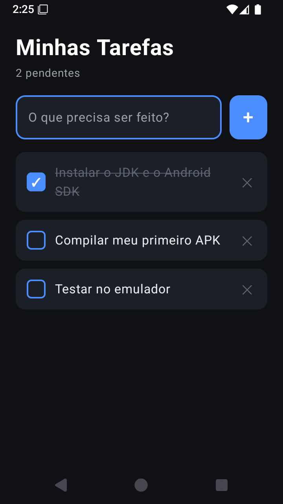

# Aplicação 2 — Android nativo (Kotlin + Jetpack Compose)

A mesma Lista de Tarefas da pasta `01-react-native-expo`, escrita em Kotlin.
Serve para mostrar em aula o contraste entre as duas abordagens.

## Por que Compose e não XML

Jetpack Compose é declarativo, igual ao React Native: a interface é uma função
do estado. Isso torna a comparação entre as duas aplicações direta, quase linha
a linha:

| Conceito | React Native | Jetpack Compose |
|---|---|---|
| Estado local | `useState(...)` | `remember { mutableStateOf(...) }` |
| Lista com reciclagem | `FlatList` | `LazyColumn` |
| Chave de item | `keyExtractor` | `key = { it.id }` |
| Entrada de texto | `TextInput` | `OutlinedTextField` |
| Toque | `Pressable onPress` | `Modifier.clickable` |
| Estilo | `StyleSheet.create` | `Modifier` encadeado |
| Empilhar na vertical | `View` + flexDirection | `Column` |
| Empilhar na horizontal | `View` + flexDirection row | `Row` |

## Estado atual deste projeto

**Compila.** Verificado em 31/08/2026 nesta máquina:

```
BUILD SUCCESSFUL in 15m 1s
37 actionable tasks: 37 executed
```

APK gerado em `app/build/outputs/apk/debug/app-debug.apk` (11,7 MB),
pacote `com.aula.tarefas`, minSdk 24, targetSdk 36.

Os 15 minutos são da **primeira** build, que baixa tudo e compila do zero.
As seguintes são muito mais rápidas graças ao cache de configuração do Gradle.

Custo em disco já pago: ~1,1 GB em `~/.gradle` (Gradle 8.14.3 + dependências).

> **Ainda não foi testado em execução.** Não havia nenhum aparelho conectado
> na hora da verificação (`adb devices` vazio). O que está comprovado é que o
> projeto compila e gera um APK válido — o comportamento em tela precisa ser
> conferido com um celular plugado.

## Versões e por que estas

| Componente | Versão | Motivo |
|---|---|---|
| Android Gradle Plugin | 8.13.0 | Suporta até API 36.1 |
| Gradle | 8.14.3 | Compatível com AGP 8.13 |
| Kotlin | 2.2.0 | O plugin do Compose acompanha a versão do Kotlin |
| Compose BOM | 2026.03.01 | Compose 1.12+ exigiria compileSdk 37 e AGP 9 |
| compileSdk / targetSdk | 36 | É o que está instalado em `C:\dev\android-sdk` |
| minSdk | 24 | Android 7.0 — cobre praticamente todo aparelho em uso |
| JDK | 17 | Já instalado (Zulu 17.0.14) |

## Como compilar (rota enxuta, sem Android Studio)

### 1. Configurar as variáveis de ambiente

```powershell
[Environment]::SetEnvironmentVariable('ANDROID_HOME','C:\dev\android-sdk','User')
$p = [Environment]::GetEnvironmentVariable('Path','User')
[Environment]::SetEnvironmentVariable('Path', "$p;C:\dev\android-sdk\platform-tools", 'User')
```

Feche e reabra o terminal para as variáveis valerem.

### 2. Gradle Wrapper

Já baixado (`gradlew`, `gradlew.bat`, `gradle/wrapper/gradle-wrapper.jar`).
Se algum dia precisar refazer:

```powershell
curl.exe -L -o gradle\wrapper\gradle-wrapper.jar `
  https://raw.githubusercontent.com/gradle/gradle/v8.14.3/gradle/wrapper/gradle-wrapper.jar
curl.exe -L -o gradlew.bat `
  https://raw.githubusercontent.com/gradle/gradle/v8.14.3/gradlew.bat
```

### 3. Compilar e instalar no celular

```powershell
.\gradlew.bat assembleDebug          # gera o APK
.\gradlew.bat installDebug           # instala no aparelho conectado
adb devices                          # confere se o celular foi reconhecido
```

O APK sai em `app\build\outputs\apk\debug\app-debug.apk`.

### 4. Preparar o celular

1. Ajustes → Sobre o telefone → tocar 7 vezes em "Número da versão"
2. Ajustes → Opções do desenvolvedor → ativar **Depuração USB**
3. Conectar por cabo e autorizar a impressão digital RSA que aparece na tela

## Como executar a aplicação

Ao contrário da versão Expo, esta **não tem um endereço local para abrir**.
O Expo compila para JavaScript e roda no navegador; Kotlin compila para um APK,
um binário de Android, que precisa de um Android para executar. Essa diferença
vale ser mostrada em aula.

### Emulador local — configurado e testado

Basta rodar:

```
rodar-emulador.bat
```

O script sobe o emulador, espera o boot, compila e instala a aplicação.



**Verificado em 31/08/2026:** a aplicação instala, abre, adiciona tarefa, marca
como concluída e remove. Nenhum crash no `logcat`.

#### O AVD "aula"

Criado com `avdmanager`, baseado em `system-images;android-35;default;x86_64`
(imagem **sem** Google Play Services — mais leve). Ajustes feitos no
`config.ini` para caber nesta máquina:

| Parâmetro | Padrão | Ajustado | Motivo |
|---|---|---|---|
| `hw.ramSize` | 2 GB | **1536 MB** | Deixa folga para o host e o WSL2 |
| `hw.lcd.width/height` | 1080×1920 | **720×1280** | Menos pixels para a GPU integrada |
| `hw.lcd.density` | 420 | **320** | Acompanha a resolução menor |
| `hw.gpu.enabled` | `no` | **`yes`** | Renderiza na HD Graphics 5500 |
| `hw.gpu.mode` | `auto` | **`host`** | Evita renderização por software |
| `hw.keyboard` | `no` | **`yes`** | Permite digitar pelo teclado do PC |
| `hw.camera.back` | `emulated` | **`none`** | Recurso inútil aqui, custa RAM |

Backup da configuração original em `~/.android/avd/aula.avd/config.ini.bak`.

Sobre a virtualização: ela **está ativa** nesta máquina. O `systeminfo` reporta
"Hipervisor detectado", e o WSL2 roda — o que só é possível com virtualização
por hardware ligada.

### Outras opções

| Opção | Disco | Limite | Observação |
|---|---|---|---|
| Celular via USB | 0 GB | Nenhum | `adb install`; o mais próximo do mundo real |
| Celular + [scrcpy](https://scrcpy.dev/) | ~50 MB | Nenhum | Espelha a tela do celular no PC, ideal para projetar |
| APK copiado na mão | 0 GB | Nenhum | Ativar "fontes desconhecidas" e tocar no arquivo |
| Appetize.io | 0 GB | **100 min/mês, sessões de 3 min** | Roda no navegador, mas o corte de 3 min atrapalha em aula |

## Limitações desta rota

- **Sem preview do Compose.** A anotação `@Preview` em `MainActivity.kt` só
  renderiza dentro do Android Studio.
- **Autocomplete limitado no VS Code.** A extensão de Kotlin não enxerga bem o
  código que o Gradle gera para projetos Compose.
- **Sem editor visual de layout.** Com Compose isso pesa menos, porque a
  interface é código, não XML arrastado na tela.

Se em algum momento houver espaço em disco sobrando, este mesmo projeto abre no
Android Studio sem nenhuma alteração — basta "Open" na pasta.
